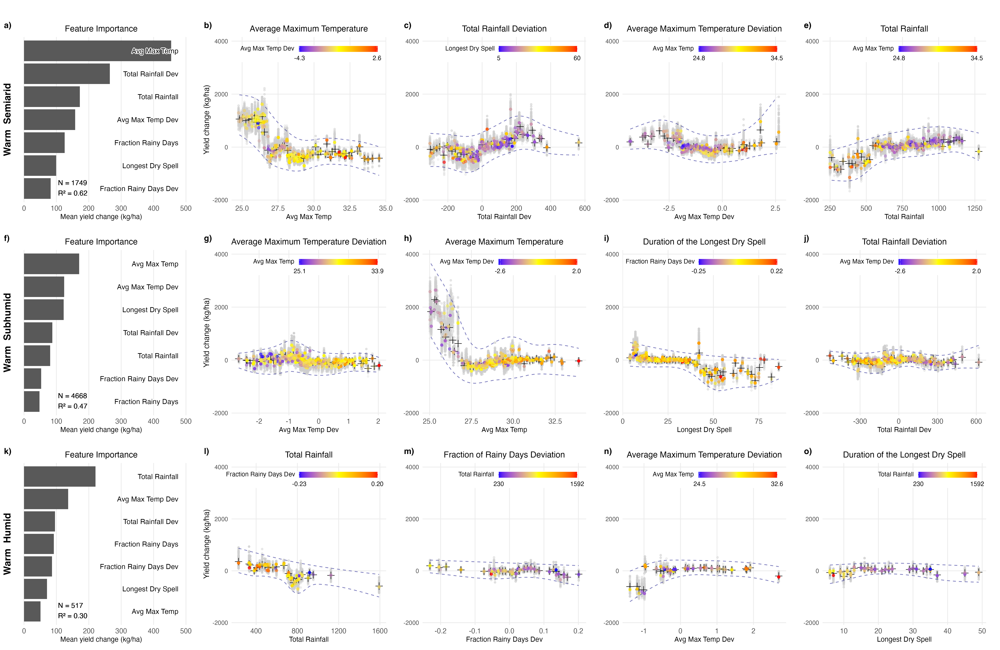

```{r setup, include=FALSE}
knitr::opts_chunk$set(eval = FALSE, echo = TRUE)
```

# Introduction

This document explains the R script used to create a grid of SHAP (SHapley Additive exPlanations) beeswarm plots for the ERA dataset. The script generates a comprehensive visualization showing how climate variables affect crop yields across different Warm Agro-Ecological Zones (AEZs) in Africa. A parallel script follows the same approach for Cool AEZs.

# Script Overview

The script creates a 3×5 grid of visualizations where:
- Each row represents a different Agro-Ecological Zone (Semiarid, Subhumid, Humid)
- The first column shows feature importance plots for each zone
- Columns 2-5 show SHAP beeswarm plots for selected climate variables
- Each SHAP plot shows the relationship between a climate feature and yield, colored by another feature to reveal interactions

This grid layout enables researchers to compare climate-yield relationships across different ecological regions while highlighting key interaction effects.

# Libraries and Dependencies

```{r libraries}
library(gridExtra)    # For arranging multiple plots in a grid
library(grid)         # For low-level grid graphics
library(scales)       # For scale functions
library(shadowtext)   # For text with background/shadow effects
library(ggplot2)      # Core plotting functionality
library(patchwork)    # For combining multiple plots
library(dplyr)        # For data manipulation
library(stringr)      # For string manipulation
library(tidymodels)   # For modeling framework
library(tidyverse)    # For data science workflow
library(yaml)         # For configuration file handling

# Custom functions for SHAP analysis
source('R/combine_shap_plots.R')
source('R/compute_shap_values.R')
source('R/estimate_metrics_simple_rf.R')
source('R/plot_bootstrap_shap.R')
source('R/plot_bootstrap_shap_gamCI.R')
source('R/analyze_bootstrap_metrics.R')
source('R/remap_formula.R')
```

# Helper Functions

```{r helper_functions}
# Function to convert technical feature names to more readable formats
spell_out_features <- function (feature_name){
  feature_name <- gsub("_", " ", feature_name)
  feature_name <- gsub("Dev", "Deviation", feature_name)
  feature_name <- gsub("Avg", "Average", feature_name)
  feature_name <- gsub("Max", "Maximum", feature_name)
  feature_name <- gsub("Temp", "Temperature", feature_name)
  feature_name <- gsub("Fraction", "Fraction of", feature_name)
  feature_name <- gsub("Longest", "Duration of the Longest", feature_name)
  return(feature_name)
}
```

# Configuration and Setup

```{r configuration}
# Set experiment name and AEZ temperature regime
experiment <- "no_outliers_eco_isqrt_nosoil"
AEZ_temp <- "Warm."
plot_type <- "GAMCI_shap_plot_"  # GAM fit for confidence bands

# Define zones to process
zones <- c("Semiarid", "Subhumid", "Humid")
R2 <- numeric(length(zones))
n_obs <- numeric(length(zones))
```

The script begins by defining the experiment name and selecting the "Warm" AEZ temperature regime. It also specifies the type of SHAP plot to use (`GAMCI_shap_plot_` uses Generalized Additive Models to fit the general trend of the confidence bands).

# Loading Performance Metrics

```{r performance_metrics}
# Process each zone to get performance metrics
for (i in seq_along(zones)) {
  # Read the metrics file for this zone
  metrics_file <- paste0("outputs/", experiment, "_", AEZ_temp, zones[i], "/full_results/cv_metrics.csv")
  
  # Read and extract R2 value
  if (file.exists(metrics_file)) {
    metrics <- read.csv(metrics_file)
    R2[i] <- metrics$mean[metrics$.metric == "rsq"]
    all_metrics <- read.csv(paste0("final_results/", experiment, "_performance_metrics.csv"))
    n_obs[i] <- all_metrics %>% 
      filter(AEZ == paste0(AEZ_temp, zones[i])) %>%
      select(N_obs) %>% pull(N_obs)
  } else {
    warning(paste("File not found:", metrics_file))
    R2[i] <- NA
  }
}
```

# Loading Feature Importance Plots

```{r importance_plots}
row_list = c("Semiarid", "Subhumid", "Humid")

# Load feature importance plots for each AEZ
shap_plot1 <- readRDS(file = paste0("outputs/", experiment, "_", AEZ_temp, 
                                    "Semiarid/full_results/plot_objects/shap_mean_importance.rds"))
levels(shap_plot1$data$feature) <- gsub("_", " ", 
                                        levels(shap_plot1$data$feature))

shap_plot2 <- readRDS(file = paste0("outputs/", experiment, "_", AEZ_temp, 
                                    "Subhumid/full_results/plot_objects/shap_mean_importance.rds"))
levels(shap_plot2$data$feature) <- gsub("_", " ", 
                                        levels(shap_plot2$data$feature))

shap_plot3 <- readRDS(file = paste0("outputs/", experiment, "_", AEZ_temp, 
                                    "Humid/full_results/plot_objects/shap_mean_importance.rds"))
levels(shap_plot3$data$feature) <- gsub("_", " ", 
                                        levels(shap_plot3$data$feature))
```

# Defining SHAP Plot Paths

```{r define_paths_row1}
plot_titles <- c()
### FIRST ROW - Semiarid ###
feature1 <- "Avg_Max_Temp"
feature1_int <- "Avg_Max_Temp_Dev"

path_beeswarm_plot11 <- paste0("outputs/", experiment, "_", AEZ_temp,
                               "Semiarid/bootstrap_plots/", plot_type,
                               feature1, "_", feature1_int, ".RDS")

feature2 <- "Total_Rainfall_Dev"
feature2_int <- "Total_Rainfall"

path_beeswarm_plot12 <- paste0("outputs/", experiment, "_", AEZ_temp,
                               "Semiarid/bootstrap_plots/", plot_type,
                               feature2, "_", feature2_int, ".RDS")

# Additional feature pairs for row 1...

plot_titles <- append(plot_titles, paste0("", spell_out_features(feature1)))
plot_titles <- append(plot_titles, paste0("", spell_out_features(feature2)))
# Additional titles...
```

# Loading SHAP Plots

After defining all paths, the script loads the actual SHAP beeswarm plots from their RDS files. Each plot shows how a specific climate variable affects crop yield, with points colored by another variable to reveal interaction effects.

```{r load_shap_plots}
# Load all SHAP beeswarm plots from their RDS files
beeswarm_plot11 <- readRDS(file = path_beeswarm_plot11)
beeswarm_plot12 <- readRDS(file = path_beeswarm_plot12)
# ... additional plot loading ...
```

# Standardizing Y-Axis Scales

To ensure that all plots are directly comparable, the script calculates the minimum and maximum y-values across all SHAP plots. It also determines the maximum x-value for the feature importance plots. These values will be used to set consistent scales across all visualizations.


```{r standardize_scales}
# Find the common y-range for all plots
y_min <- min(c(ggplot_build(beeswarm_plot11)$layout$panel_params[[1]]$y.range[1],
               ggplot_build(beeswarm_plot12)$layout$panel_params[[1]]$y.range[1],
               # ... additional plots ...
               ))

y_max <- max(c(ggplot_build(beeswarm_plot11)$layout$panel_params[[1]]$y.range[2],
               ggplot_build(beeswarm_plot12)$layout$panel_params[[1]]$y.range[2],
               # ... additional plots ...
               ))

# Find the maximum importance value for feature importance plots
imp_x_max <- max(c(ggplot_build(shap_plot1)$layout$panel_params[[1]]$x.range[2],
                   ggplot_build(shap_plot2)$layout$panel_params[[1]]$x.range[2],
                   ggplot_build(shap_plot3)$layout$panel_params[[1]]$x.range[2]
))
```


# Customizing Individual Plots

The script then customizes each plot with specific themes, titles, and annotations. As an example, here's how it processes the first feature importance plot:

```{r customize_plot1}
plot1 <- plot_list[[1]]
plot1 <- plot1 +
  theme_minimal() +
  theme(
    panel.grid.minor = element_blank(),
    plot.margin = margin(5, 20, 5, 5),
    legend.position = "none",
    axis.text.x = element_text(size = 10),
    axis.title.x = element_text(size = 10),
    axis.text.y = element_blank(), 
    axis.title.y = element_text(size = 14, face = "bold"),
    panel.grid.major.y = element_blank()
  ) +
  ggtitle("Feature Importance") + 
  theme(
    plot.title = element_text(
      size = 12,
      hjust = 0.5
    )) +
  xlim(0, imp_x_max) +
  labs(y = paste0(AEZ_temp, " ", row_list[1]),
       x = "Mean yield change (kg/ha)") +
  coord_cartesian(clip = "off") + 
  geom_shadowtext(aes(x = imp_x_max, label = feature),
                  color = "black",
                  bg.color = "white",
                  bg.r = 0.15,
                  hjust = 1,
                  size = 3.6) +
  geom_shadowtext(
    aes(x = imp_x_max * 0.22, 
        y = 0.7,
        label = sprintf("N = %d\nR² = %.2f", n_obs[1], R2[1])),
    hjust = 0,
    vjust = 0,
    size = 3.6,
    color = "black",
    bg.color = "white",
    bg.r = 0.15
  )
```

For the SHAP plots, the customization includes setting consistent y-axis limits, positioning legends, and adding titles:

```{r customize_plot2}
plot2 <- plot_list[[2]]
plot2 <- plot2 +
  theme_minimal() +
  theme(
    panel.grid.minor = element_blank(),
    plot.margin = margin(5, 20, 5, 5),
    legend.direction = "horizontal",
    legend.position = c(0.95, 0.95),
    legend.justification = c(1, 1),
    legend.box.just = "right",
    legend.margin = margin(1, 1, 1, 1),
    legend.background = element_rect(fill = "white", color = NA),
    legend.key.width = unit(0.8, "cm"),
    legend.key.height = unit(0.3, "cm"),
    legend.title = element_text(size = 9, vjust = 1),
    legend.text = element_text(size = 9),
    axis.text.x = element_text(size = 10),
    axis.title.x = element_text(size = 10)
  ) +
  ggtitle(plot_titles[1]) +
  theme(
    plot.title = element_text(
      size = 12,
      hjust = 0.5
    )) +
  ylim(y_min, y_max)
```

Similar customization is applied to all 15 plots (3 rows × 5 columns).

# Adding Panel Labels and Combining Plots

```{r combine_plots}
# Create letter labels for each panel
labels <- lapply(letters[1:length(processed_plots)], function(l) {
  textGrob(paste0(l, ")"), x = 0.02, y = 0, hjust = 0, vjust = 1, 
           gp = gpar(fontsize = 12, fontface = "bold"))
})

# Add labels to plots
labeled_plots <- mapply(
  function(plot, label) arrangeGrob(plot, top = label),
  processed_plots, labels, SIMPLIFY = FALSE
)

# Combine all plots into a single grid
combined_plot <- gridExtra::grid.arrange(
  grobs = labeled_plots,
  ncol = 5,
  top = textGrob(main_title, gp = gpar(fontsize = 12, fontface = "bold"))
)
```

The script labels each panel with a letter (a-o) and combines all plots into a 3×5 grid using `gridExtra::grid.arrange()`. This creates a comprehensive visualization that allows researchers to compare climate-yield relationships across different AEZs.

# Saving the Final Visualization

```{r save_plot}
# Save the combined plot as a PNG file
ggsave(
  paste0("final_results/", plot_type, substr(AEZ_temp, 1, 4), "no_outliers_combined_shap_plot_3x5_legends.png"), 
  combined_plot,
  width = 20,
  height = 13,
  dpi = 300
)
```

# Understanding the Visualization

The final grid visualization will look like this.

```{r, echo=FALSE, eval=TRUE, out.width='80%', fig.align='center', fig.cap='Warm AEZs SHAP plot with interactions'}

```

It provides multiple layers of information:

## Feature Importance (Column 1)
- Shows which climate variables have the strongest influence on yield in each AEZ
- Variables are ranked by their mean absolute SHAP value (impact on yield)
- Includes R² value and sample size to indicate model reliability

## SHAP Beeswarm Plots (Columns 2-5)
- X-axis: Value of the climate variable
- Y-axis: SHAP value (impact on yield prediction)
- Point color: Value of an interacting variable
- Confidence bands: Uncertainty in the relationship based on bootstrap resampling

## Reading the Plots
- Positive SHAP values: The variable increases predicted yield
- Negative SHAP values: The variable decreases predicted yield
- Steeper slope: Stronger effect on yield
- Color patterns: Reveal interaction effects between variables

## Comparing Across AEZs
- Row 1: Semiarid zones
- Row 2: Subhumid zones
- Row 3: Humid zones

# Parallel Script for Cool AEZs

There is a similar script that follows the same approach to create an equivalent visualization for the Cool AEZs (Cool Semiarid, Cool Subhumid, Cool Humid). 
